# Q u i z T i m e _ _

Quiztime is a simple quiz game that is designed and developed for users who want to test or improve their knowledge on variety of topics. It is aimed at providing a website where people can easily go to enjoy quiz gaming. It is easy to use and super friendly. This project is done in such a way that more features can easily be added in the future.

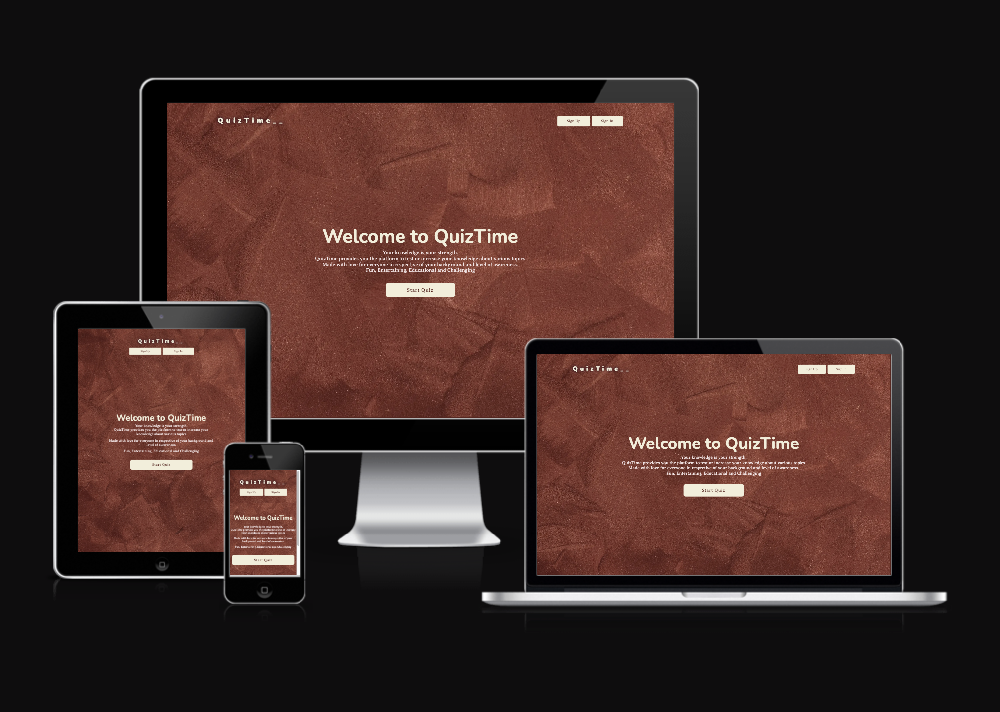

## [Please see the website working live here on GitHub page](https://chikadim.github.io/quiztime/)

## Table of Content

- [UX](#ux)
    - [User goals](#user-goals)
    - [User stories](#user-stories)
    - [Structure of the website](#structure-of-the-website)
    - [Wireframes](#wireframes)
    - [Mockup](#mockup)
- [Features](#features)
- [Testing](#testing)
    - [Validator testing](#functionality-testing)
    - [Issues found durring site development](#issues-found-durring-site-development)
    - [Performance testing](#performance-testing)
- [Deployment](#deployment)
- [Credits](#credits)
- [Screenshots](#screenshots)

## UX

### User goals

- __Website owner goals__
  - The aim of this project is to provide the users a quiz gaming platform to test their knowledge on different topics.
  - It is a user-first project that keeps the user returning for more challenging and informative questions.
  - While playing this game, the users gets to improve their knowledge or they can keep returning to have fun.

- __User goals__
  - The users look forward to a fun filled and knowledge base entertainment.
  - A user can always return to play the quiz game when they are free or bored.

  ### User stories

- __User stories as a business owner__
  - I would like to have this project getting new features to maintain a standard in the quiz gaming industry.
  - I look forward to keep users entertained with intelligent questions that are fun and challenging. 

- __User stories as a quiz game lover__
  - I would like to register on the website as a visitor to get updated when new categories or features are added.
  - As a quiz game lover, i am looking forward to get busy on the website whenever i am free.
  - When there is a means to make suggestions on the improvement of the project, i will happily and readily provide ideas or suggestions.

  ### Structure of the website

This website is structured to be user-friendly, easy to navigate and remanins well positioned on all sizes of devices. The overall performance of the website is fantastic and smooth. There are beautiful transitions between different parts of the website wether on mobile or desktop or tablet.

### Wireframes
Wireframes sketch and brainstorming
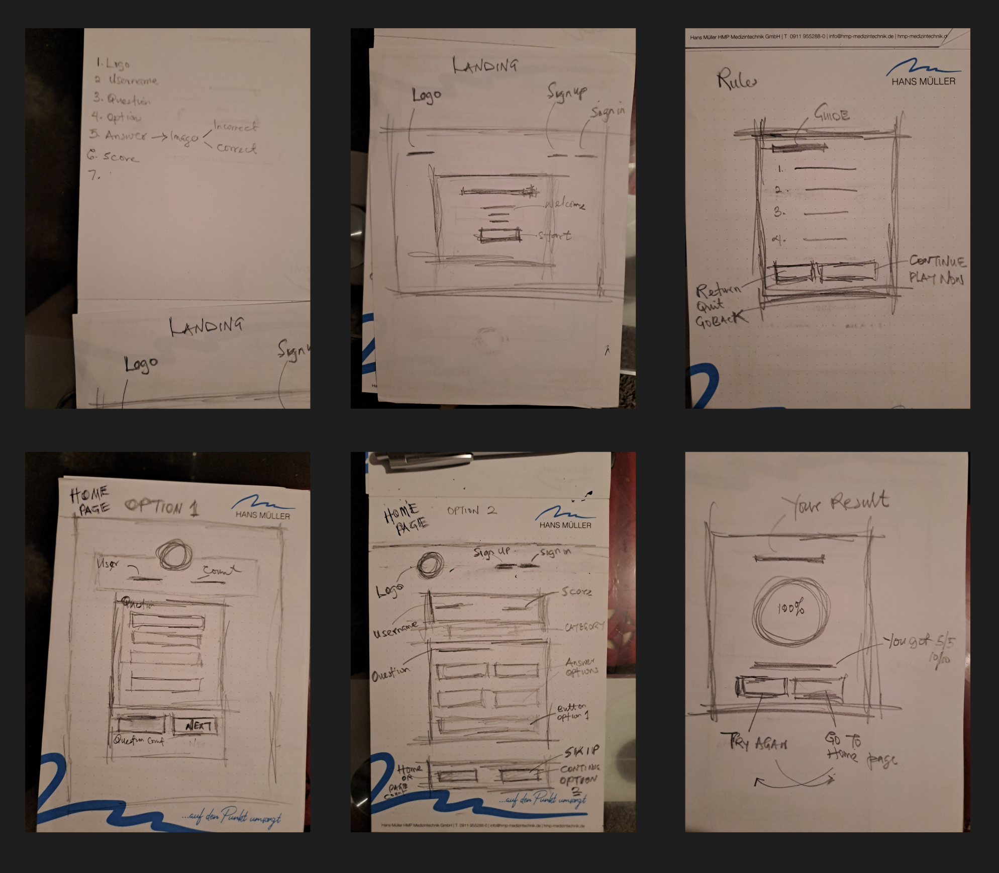

I used figma to bring out the wireframes of the website.

Web View
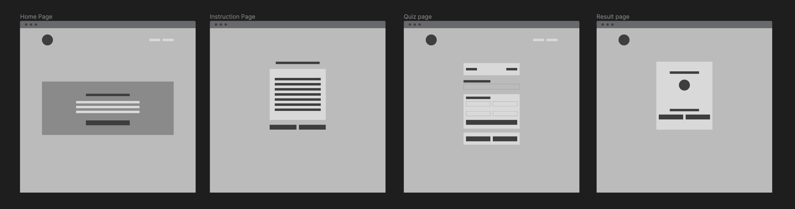
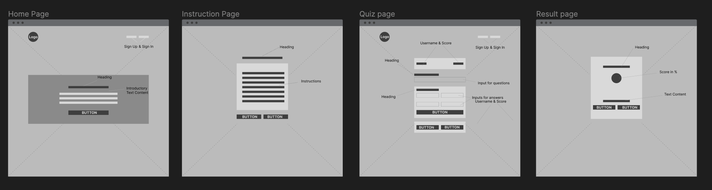

Tablet View
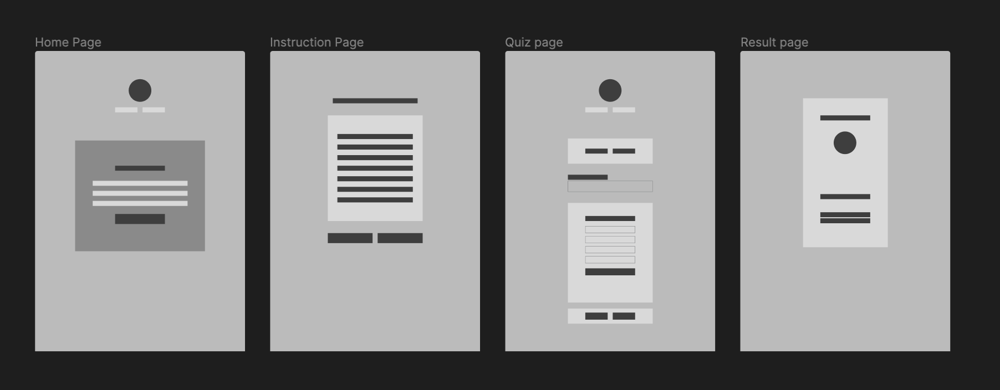
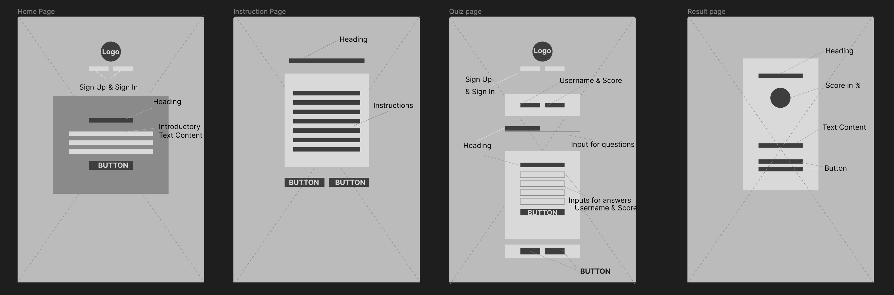

Mobile View
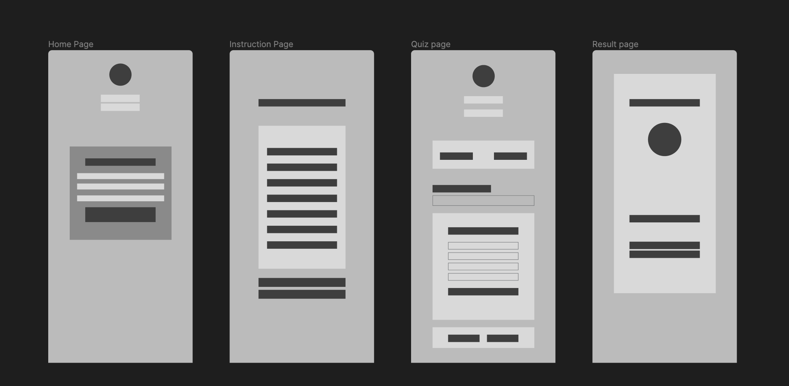
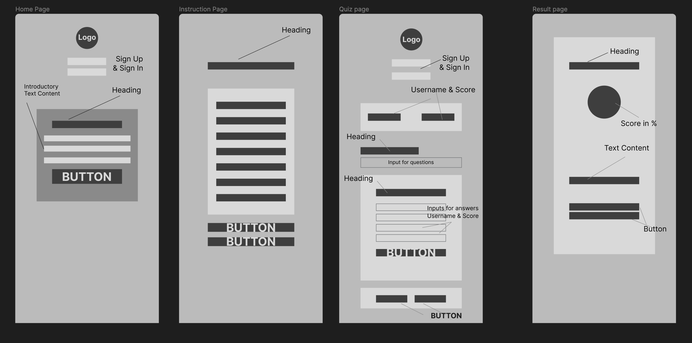

### Mockup

- __Colors__
  Main colors use in the project are as follows:
  - font color: #F3EED9
  - hover color: #8c493e
  - primary color: #59201B

  __Fonts__
  As main fonts i used Averia Serif Libre and Nunito. Then i used sans-serif as alternative.
 

- __Images__
  - I used images from [unsplash.com](www.unsplash.com) and i credited them in the [credits](#credits) section.

Web View
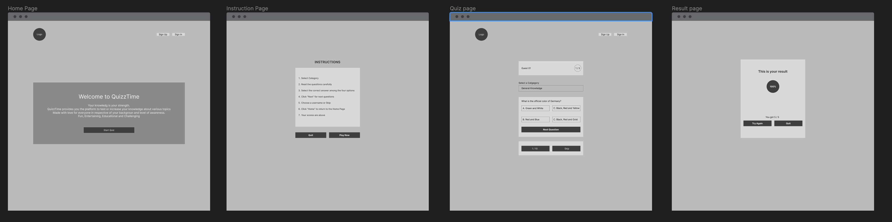

Tablet View
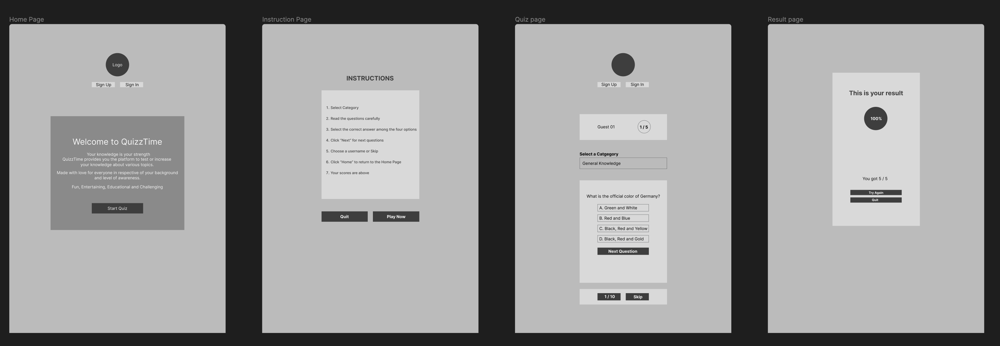

Mobile View
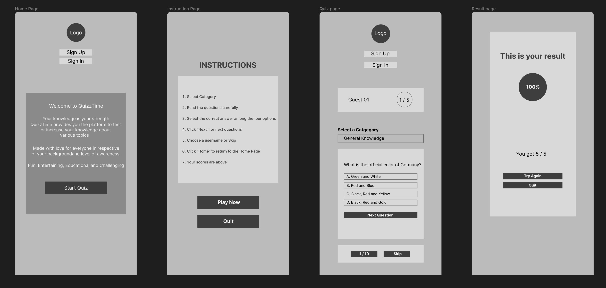
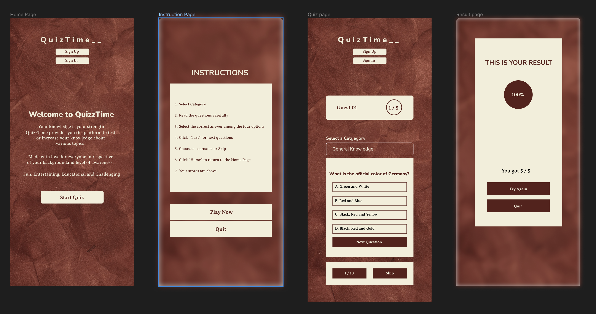

[Back to table of content](#table-of-content)

## Features

This website consists of 4 pages. They are accessible from navigation menu and also from the footer.

### Existing Features
- __Home page__
  - The header
    * The header is featured in the home page, in the quiz page and in the result page and is fully responsive. It includes the logo and the nav bar. The nav bar consists of the sign up and log in buttons
    

- __Instruction page__
  - List of instructions
    * This contains the instructions or guid on how to play the quiz. The instructions page also has quit and plan now buttons. The quit button takes you back to the home page whereas the instructions page leads you to the quiz page.
    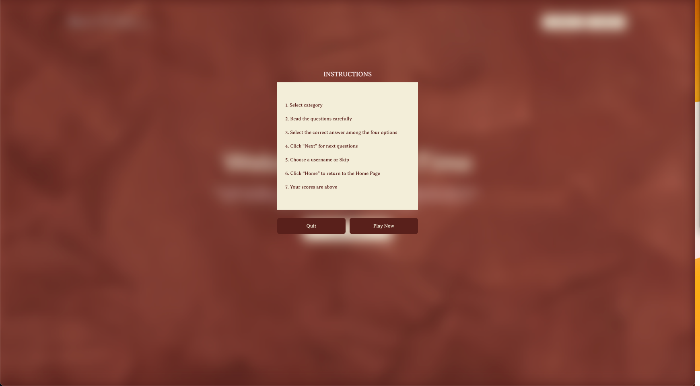

- __Quiz page__
  - User block
    * The user block shows the username and score of the player.
  - Category block
    * Here, the users select the category they want to play.
  - Question and answer options block
    * Here, the users get to see the questions and four answer options from which they can choose the correct answer 
    

- __Result page__
  - The result page shows the score of the users and calculates the percentage.
    * From here the user may decide to go back to the home page or try the game again
    

## Testing

### Validator testing
  No error found.

## Deployment

The project was deployed on GitHub Pages. I used vscode as a development environment where I commited all changes to git version control system.

To deploy a project I had to:

* Log in to GitHub and click on repository to deploy 
* select `Settings` and find GitHub Pages section at the very bottom of the page
* from source select `none` and then my branch name.
* click `save` and page was deployed after auto-refresh after it must have published.

[Back to Table of contents](#table-of-contents)

  ## Credits

* To complete this project I used Code Institute student template

* Ideas and knowledge from:

    * [w3schools.com](https://www.w3schools.com)

    * [css-tricks.com](https://css-tricks.com/)

* Images from:

    * [unsplash.com](https://www.w3schools.com)

* Icons from:

    * [iconfinder.com](https://www.iconfinder.com)