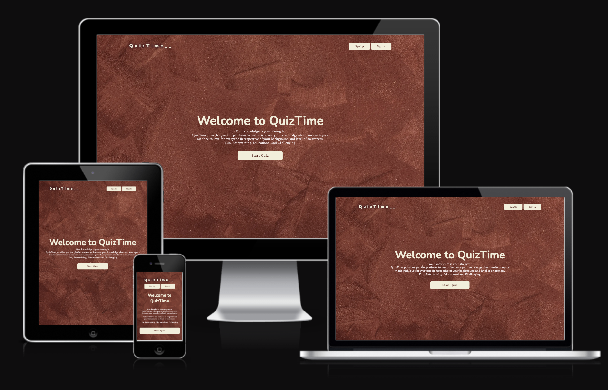

# Q u i z T i m e _ _

Quiztime is a simple quiz game that is designed and developed for users who want to test or improve their knowledge on variety of topics. It is aimed at providing a website where people can easily go to enjoy quiz gaming. It is easy to use and super friendly. This project is done in such a way that more features can easily be added in the future.

## [Please see the website working live here on GitHub page](https://chikadim.github.io/quiztime/)

## Table of Content

- [UX](#ux)
    - [User goals](#user-goals)
    - [User stories](#user-stories)
    - [Structure of the website](#structure-of-the-website)
    - [Wireframes](#wireframes)
    - [Mockup](#mockup)
- [Features](#features)
- [Testing](#testing)
    - [Validator testing](#functionality-testing)
    - [Issues found durring site development](#issues-found-durring-site-development)
    - [Performance testing](#performance-testing)
- [Deployment](#deployment)
- [Credits](#credits)
- [Screenshots](#screenshots)

## UX

### User goals

- __Website owner goals__
  - The aim of this project is to provide the users a quiz gaming platform to test their knowledge on different topics.
  - It is a user-first project that keeps the user returning for more challenging and informative questions.
  - While playing this game, the users gets to improve their knowledge or they can keep returning to have fun.

- __User goals__
  - The users look forward to a fun filled and knowledge base entertainment.
  - A user can always return to play the quiz game when they are free or bored.

  ### User stories

- __User stories as a business owner__
  - I would like to have this project getting new features to maintain a standard in the quiz gaming industry.
  - I look forward to keep users entertained with intelligent questions that are fun and challenging. 

- __User stories as a quiz game lover__
  - I would like to register on the website as a visitor to get updated when new categories or features are added.
  - As a quiz game lover, i am looking forward to get busy on the website whenever i am free.
  - When there is a means to make suggestions on the improvement of the project, i will happily and readily provide ideas or suggestions.

  ### Structure of the website

This website is structured to be user-friendly, easy to navigate and remanins well positioned on all sizes of devices. The overall performance of the website is fantastic and smooth. There are beautiful transitions between different parts of the website wether on mobile or desktop or tablet.

### Wireframes
Wireframes sketch and brainstorming

I used figma to bring out the wireframes of the website.

Web View

Tablet View

Mobile View

### Mockup

- __Colors__
  Main colors use in the project are as follows:
  - font color: #F3EED9
  - hover color: #8c493e
  - primary color: #59201B

  __Fonts__
  As main fonts i used Averia Serif Libre and Nunito. Then i used sans-serif as alternative.
 

- __Images__
  - I used images from [unsplash.com](www.unsplash.com) and i credited them in the [credits](#credits) section.

Web View

Tablet View

Mobile View

[Back to table of content](#table-of-content)

## Features

This website consists of 4 pages. They are accessible from navigation menu and also from the footer.

### Existing Features
- __Home page__
  - The header
    * The header is featured in the home page, in the quiz page and in the result page and is fully responsive. It includes the logo and the nav bar. The nav bar consists of the sign up and log in buttons
    

    * When the user clicks the sign up button, a registration form comes up requesting the user to enter a name, an email and a password.
    

    * The inputs are then verified accordingly.
    

    * When the user clicks the sign in button, a login form comes up requesting the user to enter an email and a password.
    

    * The inputs are then verified accordingly.
    

    * When a user enters the correct inputs as required then it indicates success as shown below.
    

- __Instruction page__
  - List of instructions
    * This contains the instructions or guide on how to play the quiz. The instructions page also has quit and play now buttons. The quit button takes you back to the home page whereas the play now button leads you to the quiz page.
    

- __Quiz page__
  - User block
    *At the top of the page, there is a sign out button that signs out the user and returns him/her to the home page.
    * The user block shows the username or email and score of the player.
    
  - Category block
    * Here, the users select the category they want to play.
    * There are two categories presently. The General knowledge and Sports categories. More categories can be added in the future.
    
  - Questions and answers options block
    *The questions and answers are loaded based on the category the user selected.
    * Here, the users get to see the questions and four answer options from which they can choose the correct answer
    * The user will not be able to move to a next question until an option is selected.
    * If the wrong answer is selected, then the correct answer will be shown to the user while indicating that the selected answer was wrong as shown below.
    
    * The user can decide to change category, go back to home page or continue to the next question.

- __Result page__
  - The result page shows the score of the users and calculates the percentage.
    * From here the user may decide to go back to the home page or try the game again
    * The user may also decide to sign out of the game entirely which will take him/her back to the home page
    

## Testing

### Functionality testing
I used Mozilla web developer tools and Chrome developer tools throughout the project for testing and solving problems with responsiveness and style issues.

[Unicorn Revealer](https://chrome.google.com/webstore/detail/unicorn-revealer/lmlkphhdlngaicolpmaakfmhplagoaln?hl=en-GB) extension to chrome browser was also very helpful.

- Sign up form
  * The inputs are expected to take information from the user and validate them; 
  When tested, it took information and successfully validate them.
  * The sign up button is expected to register the user and navigate the user to the quiz page;
  When tested it successfully registered the user, navigate the user properly and the inputed email is displayed on the quiz page.
  * There is a close button that is expected to close the sign up form and takes the user back to the home page;
  When tested the user was successfully returned to the home page

- Log in form
  * The inputs are expected to take information from the users, validate the information and log them in; 
  When tested it did same successfully
  * The sign in button is expected to take the users to the quiz page;
  When tested it successfully navigated the user to the quiz page
  * There is a close button that is expected to close the sign in form and takes the user back to the home page;
  When tested the user was successfully returned to the home page.

- The quiz page
  * The select category is expected to display the category options, the questions and answers options are displayed based on the category selected;
  When clicked it successfully displays the categories and also was able to load the questions and answers according to the category selected.
  * On this page there is a button that is expected to take a user to the next questions;
  When clicked it successfully navigates the user to the next questions. This button is only activated when an answer option is selected.
  * The home button is expected to navigate the user back to the home page.
  When clicked it did so successfully.
  * The sign out button is expected to sign out the user and return the user to the home page
  When tested it successfully navigates the user back to the home page

- The result page
  * The result page is expected to display the number of correct answers gotten and its equivalent in percentage.
  When tested it successfully did so
  * The try again button is expected to take the user back to the category just finished;
  When tested it successfully takes the user back to replay the category.
  * The home button is expected to navigate the user back to the home page.
  When clicked it did so successfully.
  * The sign out button is expected to sign out the user and return the user to the home page
  When tested it successfully navigates the user back to the home page
### Compatibility testing
Site was tested across multiple virtual mobile devices and browsers. I checked all supported devices in both Mozilla web developer tolls and Chrome developer tools. 
 
I tested on hardware devices such as: Apple and Windows OS's, Lenovo smartphone with Android 7, Google pixel 3 with Android 11.

## Deployment
The project was deployed on GitHub Pages. I used vscode as a development environment where I commited all changes to git version control system.

To deploy a project I had to:

* Log in to GitHub and click on repository to deploy 
* select `Settings` and find GitHub Pages section at the very bottom of the page
* from source select `none` and then my branch name.
* click `save` and page was deployed after auto-refresh after it must have published.

[Back to Table of contents](#table-of-contents)

  ## Credits

* To complete this project I used Code Institute student template

* Ideas and knowledge from:

    * [w3schools.com](https://www.w3schools.com)

    * [css-tricks.com](https://css-tricks.com/)

* Images from:

    * [unsplash.com](https://www.w3schools.com)

* Icons from:

    * [iconfinder.com](https://www.iconfinder.com)